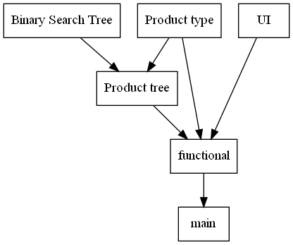

# Data Structure - Homework 8: BST

## 題目
> ImplemImplement a program for managing the products in a store by constructing a linked-based binary search tree.

## 建置
### with GNU make
```shell
make all
```
### without GNU make
```shell
gcc -c -std=gnu99 -O0 -g -Wall -Werror bst.c -o bst.o
gcc -c -std=gnu99 -O0 -g -Wall -Werror functional.c -o functional.o
gcc -c -std=gnu99 -O0 -g -Wall -Werror main.c -o main.o
gcc -c -std=gnu99 -O0 -g -Wall -Werror product.c -o product.o
gcc -c -std=gnu99 -O0 -g -Wall -Werror product_list.c -o product_list.o
gcc -c -std=gnu99 -O0 -g -Wall -Werror ui.c -o ui.o
gcc bst.o functional.o main.o product.o product_list.o ui.o -std=gnu99 -O0 -g -Wall -Werror -o main.exe
```

## 程式架構


## 程式功能
### 主選單
```
=== Menu ===
[1] Search product
[2] Import product
[3] Delete product
[4] Export product
[5] List in order
[6] Modify product information
[7] File I/O
[q] Quit
```

按下對應的按鍵即可進入對應功能的頁面(ex: 按下'1'鍵進入查詢功能的頁面)

### 查詢
```
=== Search for a product by the product number ===
Read in the product number and show all of the information of the product if the
product is found.
Press "N" key to show the next product information in increasing order of
product number, press "P" key to show the previous product information in
increasing order of product number, press "R" key to return.

Product number:
```

輸入想查詢的產品編號(ex:`1`)

如果該產品編號不存在, 輸出錯誤資訊, 按下任意鍵返回
`The product you want to search is not exists in database.`

如果該產品編號存在, 輸出其產品資料(ex: `product number: 001, price: 1, amount: 1`)
按下'p'鍵, 察看前一編號產品的資訊(ex: `product number: 000, price: 0, amount: 1`)
按下'n'鍵, 察看後一編號產品的資訊(ex: `product number: 002, price: 2, amount: 1`)

如果該產品已為最前(後)編號的產品, 輸出錯誤資訊
(ex: `Already at the front of the database.`)

按下'r'鍵, 輸出返回主選單後, 按下任意鍵返回

### 進貨
```
=== Import product ===
Read in the product number and the amount.
If the product exists, the amount of the product is increased. Otherwise, insert
the product into the tree.

Product number, Amount:
```

輸入進貨產品的編號與數量(ex:`1 1`)

如果該產品編號不存在, 系統將詢問產品的定價
`The product you want to insert is not inthe database. Please input the price:`

輸入定價後(ex: `10`), 將輸出操作行為, 按下任意鍵返回
```
=== you have inserted ===
product number: 001, price: 10, amount: 1
=== into the tree ===
```

如果該產品編號存在, 將輸出操作行為, 按下任意鍵返回
```
product number: 001, price: 1, amount: 1
=== inserted ===
product number: 001, price: 1, amount: 2
```

### 廢棄
```
=== Delete product ===
Read in the product number and delete the product from the tree if the product
is found.

Product number:
```

輸入廢棄產品的編號(ex: `1`)

如果該產品編號不存在, 輸出錯誤資訊, 按下任意鍵返回
`The product you want to delete is not exists in database.`

如果該產品編號存在, 將輸出操作行為, 按下任意鍵返回
```
=== you have just deleted===
product number: 001, price: 1, amount: 1
```

### 出貨
```
=== Export product ===
Read in the product number and the amount.
The amount of the product is decreased if the product is found and the amount is
enough.
Show error message if the amount is not enough.

Product number, Amount:
```

輸入出貨產品的編號與數量(ex:`1 1`)

如果該產品編號不存在, 輸出錯誤資訊, 按下任意鍵返回
`The product you want to export is not exists in database.`

如果該產品編號存在, 但數量不足, 輸出錯誤資訊, 按下任意鍵返回
`The product you want to export is not enough in database.`

如果該產品編號存在, 且數量充足, 將輸出操作行為, 按下任意鍵返回
```
=== you have just export ===
product number: 001, price: 1, amount: 1
=== remains ===
product number: 001, price: 1, amount: 1
```

### 列表
```
=== List all product information in increasing order of product number. ===
```

輸出目前擁有的產品的清單, 按下任意鍵返回
(ex:
```
product number: 000, price: 1, amount: 1
product number: 001, price: 1, amount: 1
product number: 002, price: 1, amount: 1
```
)
(ex:
```
The database is empty.
```
)

### 修改資料
```
=== Modify product information ===
Read in product number, the component would to modify and it's new value.
If the product exists, modify the product information as given.

Product number:
```

輸入想要修改產品的編號(ex:`1`)

如果該產品編號不存在, 輸出錯誤資訊, 按下任意鍵返回
`The product you want to modify is not inthe database.`

如果該產品編號存在, 輸出其產品資料(ex: `product number: 001, price: 1, amount: 1`)
輸出子功能選單, 按下對應的按鍵即可進入對應功能的頁面
```
=== Modify ... ? ===
[1] Modify product number
[2] Modify product price
[3] Modify product amount
[0] Return to menu
```

按下'0'鍵, 輸出返回主選單後, 按下任意鍵返回

### 匯入(出)至檔案
```
=== Import/Export product information from/to file. ===
[1] Import product information from file
[2] Export product information to file
[0] Return to menu
```

輸出子功能選單, 按下對應的按鍵即可進入對應功能的頁面
按下'0'鍵, 輸出返回主選單後, 按下任意鍵返回

#### 匯入至檔案
```
=== Import product information from file. ===

File name:
```

輸入檔案的完整名稱(含附檔名)(ex: `info.txt`)

如果檔案不存在, 輸出錯誤資訊
`Error: file: info.txt did not exist.`

如果檔案存在, 系統將匯入檔案內的資料

#### 匯出至檔案
```
=== Export product information to file. ===

File name:
```

輸入檔案的完整名稱, 系統將匯出資料至檔案
**警告: 會直接複寫檔案**

## 最高價物品
```
=== The product number with highest price ===
```

還沒做XD

## License
Copyright (c) 2020 Nick, Lin

Permission is hereby granted, free of charge, to any person obtaining a
copy of this software and associated documentation files (the "Software"),
to deal in the Software without restriction, including without limitation
the rights to use, copy, modify, merge, publish, distribute, sublicense,
and/or sell copies of the Software, and to permit persons to whom the
Software is furnished to do so, subject to the following conditions:

The above copyright notice and this permission notice shall be included in
all copies or substantial portions of the Software.

THE SOFTWARE IS PROVIDED "AS IS", WITHOUT WARRANTY OF ANY KIND, EXPRESS OR
IMPLIED, INCLUDING BUT NOT LIMITED TO THE WARRANTIES OF MERCHANTABILITY,
FITNESS FOR A PARTICULAR PURPOSE AND NONINFRINGEMENT. IN NO EVENT SHALL THE
AUTHORS OR COPYRIGHT HOLDERS BE LIABLE FOR ANY CLAIM, DAMAGES OR OTHER
LIABILITY, WHETHER IN AN ACTION OF CONTRACT, TORT OR OTHERWISE, ARISING
FROM, OUT OF OR IN CONNECTION WITH THE SOFTWARE OR THE USE OR OTHER
DEALINGS IN THE SOFTWARE.

